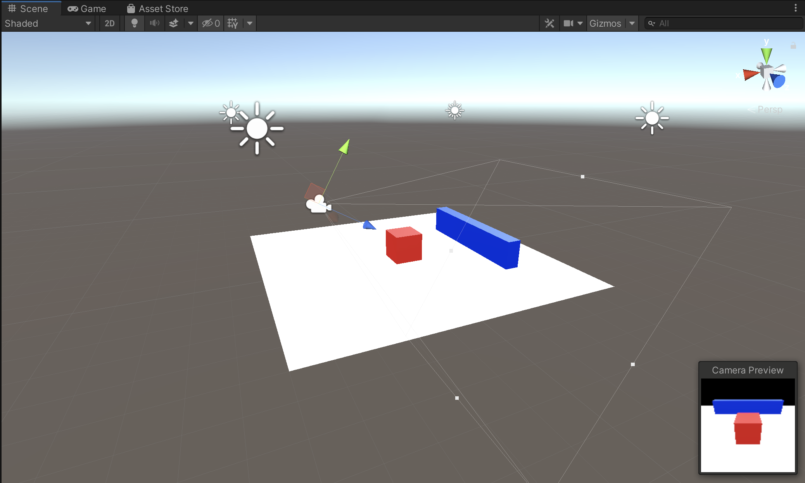
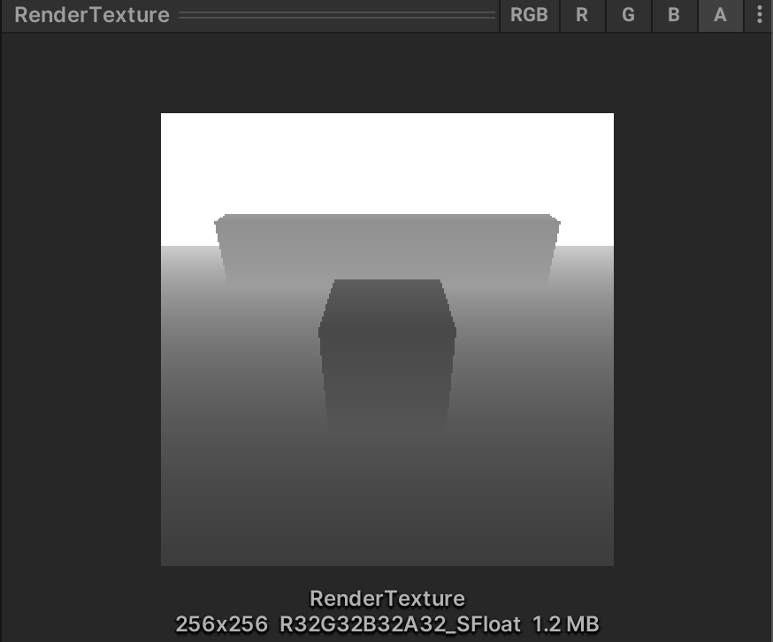
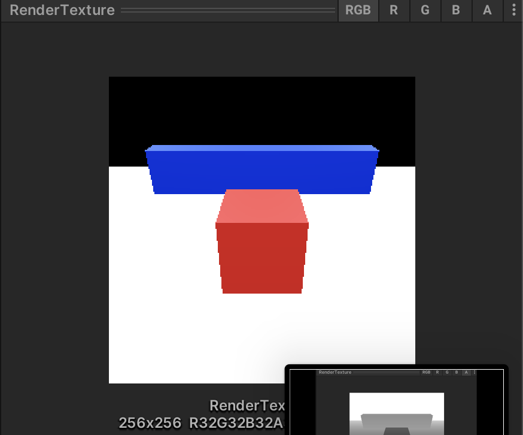

# [RGB-D Rendering with Unity](https://samarth-robo.github.io/blog/2021/12/28/unity_rgbd_rendering.html)

**Read more**: https://samarth-robo.github.io/blog/2021/12/28/unity_rgbd_rendering.html.

<figure>
    
    <figcaption>scene</figcaption>
</figure>

<figure>
    
    <figcaption>depth</figcaption>
</figure>
<figure>
    
    <figcaption>RGB</figcaption>
</figure>